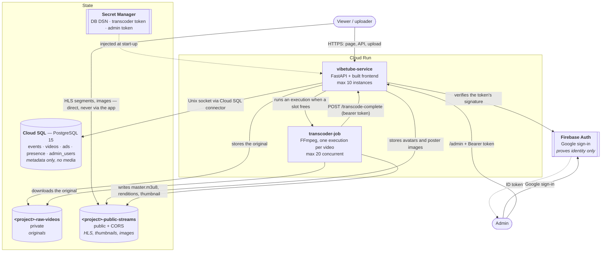

# Vibetube Video Streaming Platform

Vibetube is an event-based video streaming platform with a cinematic neon/glow aesthetic.

Viewers enter an **event code** to reach a showroom at `/e/CODE`. Each showroom is an isolated
mini-Vibetube: its own copy of the seed videos, its own uploads, and its own upload window.
Anyone with the link can watch; uploading is only possible while that event's window is open.

## How it is packaged

The app ships as **one container**: FastAPI serves both the JSON API and the built React app,
so there is no proxy hop and no second service to keep in sync. The transcoder is separate
because it is a batch job, not a web server — it runs for minutes at 100% CPU per video and
scales on a completely different curve from the API.

| Component | Stack | Deploys as |
|---|---|---|
| `frontend/` + `backend/` | React 18 + Vite, FastAPI | One Cloud Run **service** (root `Dockerfile`) |
| `transcoder/` | Python, FFmpeg | One Cloud Run **job** |

Storage is SQLite locally and Cloud SQL PostgreSQL in the cloud, selected by `DATABASE_URL`.

> `CATCHUP.md` and `ARCHITECTURE.md` predate both the event system and this single-container
> layout. Treat this README as the current reference.

## What a showroom shows

Each card carries a title, uploader name, and the absolute upload time in the viewer's own
timezone. Timestamps are stored as ISO-8601 UTC and formatted client-side.


### Switching showrooms

The chip row at the top of a showroom lists every other event; clicking one switches rooms. The
gate page carries the same list as tags under the code field, ordered by how near each event's
date is to today — past and future alike, so yesterday's showroom ranks with tomorrow's — and
marks anything running today.

Both are backed by `GET /api/events`, which returns `code`, `name`, and the three timestamps the
ordering needs (`uploadOpensAt`, `uploadClosesAt`, `createdAt`). No counts and no content. The
client picks the first non-null of the three as "the event's date".

> **This makes every event code public.** Codes are generated non-sequentially so that one
> cannot be used to guess another, but listing them removes that protection: anyone in any
> showroom can now see and enter all the others. If a room ever needs to stay private, that
> endpoint has to become authenticated or filtered.

### Sharing a video

Opening a video puts its id in the URL as `/e/CODE?v=<videoId>`, and the player offers **X**,
**LinkedIn**, and **Copy link**. A shared link opens straight into that video; if the video has
since been removed, the link falls back to the grid rather than erroring.

**Link previews are rendered server-side.** LinkedIn and X fetch the URL to build their card
and do not execute JavaScript, so the SPA fallback injects Open Graph and Twitter card tags into
the HTML before serving it — per video, per showroom, and a site default elsewhere. The card
shows the video's own thumbnail and a line in the uploader's voice.

> **Previews only work from a public URL.** A crawler cannot reach `localhost`, so testing a
> share locally will always show "cannot display preview". Deploy first, then check with
> [LinkedIn Post Inspector](https://www.linkedin.com/post-inspector/) — which also force-refreshes
> LinkedIn's cache, since it holds a preview for around 7 days and will otherwise keep serving
> the first (empty) one it saw.


---

## Running locally

Locally there is **no GCS and no transcoder**. Uploads are written to `backend/uploads/` and are
playable immediately, so videos never sit in a "processing" state. Metadata lives in a SQLite
file at `backend/vibetube.db`. Both are gitignored.

### Prerequisites

- Node.js 18+
- Python 3.11+

### The quick way

```bash
./dev.sh
```

This creates the virtualenv and installs dependencies on first run, starts both halves, and
shuts both down on Ctrl-C. Then open http://localhost:5173 and enter `sandbox`, or go straight
to http://localhost:5173/e/sandbox.

**Development runs two processes on purpose.** Vite serves the frontend with hot reload and
proxies `/api` to the backend on port 8000. The single-container layout is for deployment —
building the image on every edit would make the feedback loop unusable.

### Or start each half yourself

```bash
# Terminal 1
cd backend
python3 -m venv venv && source venv/bin/activate
pip install -r requirements.txt
cp .env.example .env
export ADMIN_TOKEN=local-admin-token
python main.py                # http://127.0.0.1:8000

# Terminal 2
cd frontend
npm install
npm run dev                   # http://localhost:5173
```

On first start the backend creates the schema, creates a `sandbox` event, and seeds it with the
8 default videos. Existing videos from before events existed are migrated into `sandbox`.

> **Viewing and uploading are anonymous** — no sign-in, and the frontend needs no environment
> file. The only place that authenticates anybody is the `/admin` console, which uses Google
> sign-in plus an allowlist; see [Admin console](#admin-console).
>
> The admin API **fails closed**, so with no Firebase configuration locally every
> `/api/admin/*` call returns 503 and the console shows "sign-in unavailable". To work on it,
> set the three `FIREBASE_*` values in `backend/.env` (see `backend/.env.example`) — Firebase
> authorises `localhost` by default, so nothing else is needed. The `backend/admin.py` CLI
> needs none of this and remains the way to manage events without signing in.

### Running the production container locally

To exercise exactly what deploys — one process, one port, no Vite:

```bash
docker build -t vibetube .
docker run --rm -p 8080:8080 -e ADMIN_TOKEN=local-admin-token vibetube
```

Then open http://localhost:8080/e/sandbox. The API is on the same origin at
`http://localhost:8080/api/...`. There is no hot reload here; rebuild to see changes.

### Where thumbnails come from

Three different places, which is worth knowing when one looks wrong:

| Source | Thumbnail |
|---|---|
| The 8 seed videos | Static JPEGs shipped in `frontend/public/images/thumbnails/`, referenced by `mockVideos.json`. Nothing generates them |
| Uploads in the cloud | FFmpeg extracts a frame at the video's **midpoint** (`transcoder/converter.py`), uploads it beside the HLS renditions, and the completion callback writes the URL back |
| Uploads locally | None. The row is created with `"?"` and there is no transcoder to replace it |

The midpoint is used rather than the first frame because opening frames are so often black.
A `?` on a locally uploaded card is expected, not a fault.

---

## Managing events

Events are created from the shell with the admin CLI. Run it from `backend/` with the same
environment as the server (it writes to the same database).

```bash
cd backend

# Create a showroom with an auto-generated code, seeded with the 8 default videos
python admin.py create-event --name "Vibe Summit 2026"

# Explicit code plus an upload window, entered in local time
python admin.py create-event \
  --name "Vibe Summit 2026" \
  --code SUMMIT \
  --opens  "2026-09-01 09:00" \
  --closes "2026-09-01 18:00" \
  --tz America/Los_Angeles

python admin.py list-events               # code, video count, upload state, window
python admin.py set-window --code SUMMIT --closes "2026-09-01 20:00" --tz America/Los_Angeles
python admin.py set-window --code SUMMIT --clear-closes    # uploads open indefinitely
python admin.py purge-event --code SUMMIT                  # deletes the event and its videos
```

Times are entered in the timezone you pass and stored as UTC. Omitting `--opens`/`--closes`
leaves that side unbounded. Codes are generated from a non-ambiguous alphabet (no `0`/`O`,
no `1`/`I`) and are non-sequential, so one code cannot be used to guess another.

`purge-event` removes database rows only. It prints the `gsutil` command for the corresponding
media but does not run it.

---

## Testing uploads

All examples assume the local backend on port 8000. You need a **real video file** — the server
sniffs the first bytes for a container signature, so random bytes with a `.mp4` name are
rejected. Grab a small public clip:

```bash
curl -sL -o /tmp/test-clip.mp4 https://media.w3.org/2010/05/sintel/trailer_hd.mp4
```

### What the server rejects

| Condition | Status | Notes |
|---|---|---|
| Larger than `MAX_UPLOAD_BYTES` (50 MB) | `413` | Measured while streaming, not from `Content-Length` |
| Not a recognised video container | `400` | ISO/MP4, Matroska/WebM, AVI, Ogg, FLV, MPEG accepted |
| Empty file | `400` | |
| Upload window closed | `403` | Server clock, not the browser's |
| Showroom at `MAX_UPLOADS_PER_EVENT` (300) | `409` | Total guest uploads, for the life of the showroom |
| Title, description or name flagged by screening | `422` | Model Armor — see [Content screening](#content-screening) |

All of these are checked **before** anything is written to disk or GCS, so a rejected upload
costs no storage. The format sniff is a cheap gate, not full validation — the transcoder is
still the authority on whether a file is actually usable.

Note what is **not** in that list: being at the transcode concurrency cap. Uploads over
`MAX_CONCURRENT_TRANSCODES` are queued, not refused — see below.

---

## Uploading from another system

The upload endpoint is a plain `multipart/form-data` POST with **no authentication** — the event
code in the URL is the only gate. Anything that can send a multipart request can publish into a
showroom while its upload window is open.

```
POST  https://<service-url>/api/events/{code}/videos
Content-Type: multipart/form-data
```

`{code}` is the showroom code, e.g. `SUMMIT`. Case-sensitive.

### Request fields

| Field | Type | Required | Default | Notes |
|---|---|---|---|---|
| `videoFile` | file | **yes** | — | Max 50 MB. Must be a real video container |
| `title` | text | **yes** | — | Shown on the card |
| `description` | text | no | `""` | Shown in the player |
| `displayName` | text | no | `Anonymous Vibe` | Uploader name on the card |
| `projectId` | text | **yes** | — | Identifies the submission. Re-using one **replaces** that project's video in place |
| `duration` | text | no | — | Rarely needed. Overwritten with the true runtime once transcoding finishes |
| `avatarFile` | file | no | — | Max 5 MB. JPEG/PNG/GIF/WebP. Omitted → initials shown |
| `thumbnailFile` | file | no | — | Max 5 MB. Omitted → a frame from the video's midpoint |

### Response

```json
{ "id": "v_44d4a0801ac2", "status": "success" }
```

`200` means **accepted**, not published. In the cloud the video is queued and becomes playable
minutes later; poll `GET /api/events/{code}/videos` and watch that `id` until its `status` is
`ready`.

### Errors

| Status | Meaning |
|---|---|
| `400` | Empty file, unrecognised video container, or an `avatarFile`/`thumbnailFile` that is not an image |
| `403` | The showroom's upload window is closed |
| `404` | No showroom with that code |
| `400` | Missing `projectId`, empty file, unrecognised container, or a non-image avatar/thumbnail |
| `409` | The showroom hit its 300-upload cap, **or** that project's previous upload is still transcoding |
| `413` | `videoFile` over 50 MB, or an image over 5 MB |
| `503` | Server busy (connection pool saturated) — retryable, honours `Retry-After` |

Every error returns `{"detail": "..."}` with a message safe to show a user. Nothing is stored
when a request is rejected.

### Examples

```bash
# Minimal
curl -X POST https://<service-url>/api/events/SUMMIT/videos \
  -F "title=Our Demo" \
  -F "projectId=our-demo-01" \
  -F "videoFile=@demo.mp4"

# Everything
curl -X POST https://<service-url>/api/events/SUMMIT/videos \
  -F "title=Team Rocket Demo" \
  -F "description=What we built and why" \
  -F "displayName=Christina Lin" \
  -F "projectId=team-rocket-01" \
  -F "videoFile=@demo.mp4" \
  -F "avatarFile=@me.jpg" \
  -F "thumbnailFile=@poster.png"
```

```python
import requests

with open("demo.mp4", "rb") as video, open("poster.png", "rb") as poster:
    response = requests.post(
        "https://<service-url>/api/events/SUMMIT/videos",
        data={
            "title": "Team Rocket Demo",
            "description": "What we built and why",
            "displayName": "Christina Lin",
            "projectId": "team-rocket-01",
        },
        files={"videoFile": video, "thumbnailFile": poster},
        timeout=300,          # a 50 MB upload over a slow link takes a while
    )
response.raise_for_status()
video_id = response.json()["id"]
```

Do **not** compute or send `duration` — ffprobe measures it during transcoding and the
completion callback overwrites whatever was stored. Anything you send is a temporary
placeholder shown for the few minutes before the video becomes `ready`.

### Pre-roll ads

A project can attach an ad that plays for **10 seconds** before its video. Matching is on
`projectId` — the same identifier the video was uploaded with:

```
video.projectId  ==  ad.projectId

  team-rocket-01  video   ->   team-rocket-01  ad   ->  10s ad, then the video
  neon-lab-02     video   ->   (no ad)              ->  video plays immediately
```

A video with no matching ad plays straight away. Nothing else is affected.

#### Step 1 — upload the video with a project ID

`projectId` is **required** on every guest upload, and it is the key everything else hangs off
— the ad matches on it, and the admin console deletes by it. The ad attaches to an existing
video, so the video has to be uploaded first; posting an ad for a project with no video returns
`409`.

```bash
curl -X POST https://<service-url>/api/events/SUMMIT/videos \
  -F "title=Team Rocket Demo" \
  -F "displayName=Christina Lin" \
  -F "projectId=team-rocket-01" \
  -F "videoFile=@demo.mp4"
```

#### Step 2 — attach the ad using the same project ID

```
POST /api/events/{code}/ads       (multipart/form-data)
```

| Field | Required | Notes |
|---|---|---|
| `projectId` | **yes** | Must match a video already in this showroom |
| `message` | **yes** | Max 280 characters |
| `imageFile` | no | Max 5 MB. JPEG, PNG, GIF or WebP |

**Text-only ad** — gets the animated treatment:

```bash
curl -X POST https://<service-url>/api/events/SUMMIT/ads \
  -F "projectId=team-rocket-01" \
  -F "message=Team Rocket ships faster with Google Cloud. Try it free."
```

**With an image** — the image fills the frame, the message sits beneath it:

```bash
curl -X POST https://<service-url>/api/events/SUMMIT/ads \
  -F "projectId=team-rocket-01" \
  -F "message=Team Rocket ships faster with Google Cloud." \
  -F "imageFile=@sponsor.png"
```

```python
import requests

requests.post(
    "https://<service-url>/api/events/SUMMIT/ads",
    data={
        "projectId": "team-rocket-01",       # must match the video's projectId
        "message": "Team Rocket ships faster with Google Cloud.",
    },
    files={"imageFile": open("sponsor.png", "rb")},   # optional
    timeout=60,
).raise_for_status()
```

Success returns the ad's id:

```json
{ "id": "ad_3c50f7774948", "projectId": "team-rocket-01", "status": "success" }
```

#### Step 3 — check it took

```bash
curl -s https://<service-url>/api/events/SUMMIT/ads/team-rocket-01
```

```json
{ "ad": { "id": "ad_3c50f...", "projectId": "team-rocket-01",
          "message": "Team Rocket ships faster...", "imageUrl": null,
          "durationSeconds": 10 } }
```

`{"ad": null}` means nothing will play — either no ad was stored for that project, or it has
been disabled. This endpoint returns `200` either way rather than a `404`, so the player has a
single success path.

Organisers can list everything in one go, including disabled ads:

```bash
cd backend && python admin.py list-ads --code SUMMIT
```

#### Updating or replacing an ad

Post again with the **same `projectId`**. It overwrites the message in place and reactivates the
ad if it had been disabled. Omitting `imageFile` on a re-submit **keeps the existing image** —
send a new one to change it.

```bash
curl -X POST https://<service-url>/api/events/SUMMIT/ads \
  -F "projectId=team-rocket-01" \
  -F "message=Updated copy, same project."
```

#### Errors

| Status | Meaning |
|---|---|
| `400` | Empty message, message over 280 characters, or a file that is not an image |
| `403` | Ad submissions are closed for this showroom (see below) |
| `404` | No showroom with that code |
| `409` | No video exists yet for that `projectId` — do Step 1 first |
| `413` | Image over 5 MB |

#### How it plays

The player fetches `GET /api/events/{code}/ads/{projectId}` when a video opens — deliberately
not bundled into the video list, which every viewer polls every 5 seconds.

**With an image** the image fills the frame with the message beneath. **Without one** the
message gets an animated treatment: a drifting colour field behind gradient type. Both show an
`AD` badge, a countdown, and a progress bar. There is no skip.

The video is not loaded at all while the ad runs — its `src` is unset — so nothing is
downloaded behind the pre-roll. Everything fails open: no ad, a failed fetch, or a broken image
all mean the video plays immediately. If the browser then refuses to autoplay, a large play
button appears rather than a frozen frame.

### Closing ad submissions

```bash
python admin.py list-ads --code SUMMIT
python admin.py set-ads --code SUMMIT --closes "2026-09-01 20:00" --tz America/Los_Angeles
python admin.py set-ads --code SUMMIT --clear-closes   # submissions open indefinitely
python admin.py set-ads --code SUMMIT --disable        # stop every ad from playing
python admin.py set-ads --code SUMMIT --enable
```

There are two independent controls, and the distinction matters:

| Control | Effect |
|---|---|
| `--closes` (`adsClosesAt`) | Freezes the set of ads. New and replacement submissions get a `403`. **Ads already uploaded keep playing indefinitely.** |
| `--disable` | Stops every ad in the showroom from playing. Reversible with `--enable`. |

An ad does not expire once uploaded. The deadline exists so that copy cannot be changed after
the event, not so the pre-rolls disappear — a showroom's videos should not silently lose their
ads the moment the window shuts. Use `--disable` when you actually want them gone.

`purge-event` deletes a showroom's ads along with its videos.

### Replacing a submission

Re-uploading with a `projectId` that already exists **overwrites that video in place** rather
than creating a second one. This is the normal path for teams iterating on a submission.

- The video keeps its **id**, so any `?v=<id>` link already shared keeps working.
- It does **not** count against the showroom's upload cap.
- The profile picture is kept if the re-upload omits one; send a new `avatarFile` to change it.
- The thumbnail always resets — the old poster frame belongs to the old video. Send a new
  `thumbnailFile` to set one, or let the transcoder generate it.
- `createdAt` updates to the replacement time, so the card sorts as recently changed.

A replacement is refused with `409` while the previous upload for that project is still
`pending` or `processing`: the in-flight job would otherwise call back against a row it no
longer describes and overwrite the new video's URLs with the old one's output. Wait for it to
reach `ready` (or `failed`) and retry. Replacing a `failed` video is allowed, which is how you
retry after a bad encode.

### Reading a showroom back

`GET /api/events/{code}/videos` returns an array, newest first, each entry shaped:

```json
{
  "id": "v_44d4a0801ac2",
  "eventId": "SUMMIT",
  "title": "Team Rocket Demo",
  "description": "What we built and why",
  "projectId": "team-rocket-01",
  "channelName": "Christina Lin",
  "channelAvatar": "https://storage.googleapis.com/.../images/ab12.jpg",
  "thumbnailUrl": "https://storage.googleapis.com/.../thumbnail.jpg",
  "videoUrl": "https://storage.googleapis.com/.../master.m3u8",
  "duration": "4:32",
  "createdAt": "2026-08-14T18:22:40.538971+00:00",
  "status": "ready",
  "source": "upload"
}
```

`status` is one of `pending`, `processing`, `ready`, `failed`. **Only `ready` is playable.**
`videoUrl` is an HLS master playlist once transcoding finishes; before that it points at the
raw upload and should not be used. A `"?"` in `channelAvatar` or `thumbnailUrl` means "none
supplied" — render initials or a placeholder.

`GET /api/events/{code}` returns the showroom itself, including `uploadOpen` — check it before
uploading to fail fast rather than on a `403`.

### Seeding as an organiser

Two admin routes bypass the upload window and the per-showroom cap. Both require the token from
Secret Manager in an `X-Admin-Token` header; they return `503` if `ADMIN_TOKEN` is unset on the
server and `403` if it does not match.

- `POST /api/events/{code}/seed` — JSON metadata for videos already hosted elsewhere. No
  transcoding, appears instantly.
- `POST /api/events/{code}/seed-upload` — same multipart form as above, run through the full
  pipeline.

See [Seed a showroom over HTTP](#seed-a-showroom-over-http) for worked examples.

---

### The transcode queue

Transcoding is the expensive part of the system: every upload is a Cloud Run Job running FFmpeg
across three renditions, taking minutes of CPU. The queue exists so that a busy showroom slows
down instead of failing.

#### States

A video moves through five states, and the card in the grid shows each one:

| Status | Meaning | What the viewer sees |
|---|---|---|
| `pending` | Accepted and queued. No job started yet | **Queued** — "waiting for a free slot" |
| `processing` | A transcoder job holds it | **Processing** — spinner |
| `ready` | Playable | The thumbnail, or **Preparing preview** until one exists |
| `failed` | The job died, or never started | Warning overlay |
| `blocked` | Rejected by content screening | **Under review** overlay, no reason given |

Only `ready` is playable. Locally there is no transcoder, so uploads skip straight to `ready`
and the raw file *is* the final artifact.

#### How it drains

`MAX_CONCURRENT_TRANSCODES` (20) is a **per-showroom** ceiling. On upload the row is written
`pending`, then `drain_queue` promotes as many queued rows as there is room for, oldest first.

The queue is advanced in three places, all of them event-driven — nothing polls it:

1. **After an upload**, in case a slot is free
2. **On `transcode-complete`**, since a slot just opened
3. **On `transcode-failed`**, so the queue does not stall on bad videos

Claiming is race-safe by **compare-and-swap**, not by locking. `claim_next_pending` selects the
oldest `pending` row, then updates it with `WHERE id = ? AND status = 'pending'`. If another
instance claimed it in between, that update matches zero rows and this drain returns empty
rather than triggering a second job for the same video.

Each job is triggered *outside* the transaction that claimed it. Holding a database connection
open across a Cloud Run API call would tie up a pool slot for a network round trip, and the
pool is deliberately small.

#### Why it is a queue and not a rejection

An earlier version refused uploads over the cap with a `429`. At an event that meant a wall of
errors and people retrying by hand — 300 uploads against a 20-slot cap would have rejected the
other 280. Now every accepted upload succeeds and simply waits its turn.

The visible cost is latency, not failure: with 20 slots and a few minutes per transcode, a
300-video showroom works through its backlog steadily while everyone can already see their
entry sitting in the grid marked **Queued**.

#### Stuck jobs

A job that dies without reporting back would hold its slot forever, and enough of those would
wedge a showroom at its ceiling permanently. Any row `processing` for longer than
`TRANSCODE_STALE_MINUTES` (30) is therefore treated as dead: marked `failed` and its slot
released. The sweep runs as part of every drain, so recovery needs no cron job.

#### Watching it happen

The grid polls every 5 seconds **only while something is `pending` or `processing`** — an idle
showroom makes no requests at all. Cards swap themselves from Queued to Processing to playable
without anyone refreshing.

```bash
# What the queue is doing right now
python admin.py list-events            # per-event video counts
```

#### Limits worth knowing

- **The cap is per showroom, not global.** Ten busy rooms can run 200 concurrent jobs between
  them. Nothing bounds the total.
- **The drain loop itself is not locked across instances.** Individual rows cannot be
  double-claimed, but two instances draining simultaneously can briefly exceed
  `MAX_CONCURRENT_TRANSCODES`. It is bounded and self-corrects on the next drain.
- **One failure mode is unreportable.** If a transcoder finishes but cannot reach the backend,
  neither callback lands; the row stays `processing` until the stale sweep fails it, so a
  successfully transcoded video is lost. A retry queue would be the real fix.

### Concurrent viewers

Each showroom admits `MAX_CONCURRENT_VIEWERS` (2000) at once, enforced by a heartbeat to
`POST /api/events/{code}/presence` every 30s. A seat is held for `PRESENCE_TTL_SECONDS` (90),
so a viewer who closes the tab frees theirs shortly after. Over capacity returns `503` and the
"showroom is full" screen; an **already-present** viewer is never evicted, so a full room stops
admitting rather than ejecting.

The count is approximate by design — it is keyed on a random `clientId` in `localStorage`, so
the same person in two browsers counts twice.

### Upload into an open showroom

```bash
curl -X POST http://localhost:8000/api/events/sandbox/videos \
  -F "title=My Test Clip" \
  -F "description=Uploaded from curl" \
  -F "displayName=Christina" \
  -F "projectId=my-test-01" \
  -F "videoFile=@/tmp/test-clip.mp4"
# {"id":"v_a1b2c3d4e5f6","status":"success"}
```

`displayName` is optional and defaults to `Anonymous Vibe`. No authentication is involved.

### Confirm it landed, and only in that showroom

```bash
curl -s http://localhost:8000/api/events/sandbox/videos | python3 -m json.tool | head -20
```

The newest upload sorts first. Listing a different event will not include it.

### Confirm oversized and non-video uploads are refused

```bash
# 60 MB of noise: fails the size check first
head -c 60000000 /dev/urandom > /tmp/too-big.mp4
curl -s -o /dev/null -w "%{http_code}\n" -X POST \
  http://localhost:8000/api/events/sandbox/videos \
  -F "title=Too Big" -F "projectId=too-big-01" -F "videoFile=@/tmp/too-big.mp4"
# 413

# A text file wearing a .mp4 extension
echo "not a video" > /tmp/fake.mp4
curl -s -X POST http://localhost:8000/api/events/sandbox/videos \
  -F "title=Fake" -F "projectId=fake-01" -F "videoFile=@/tmp/fake.mp4"
# {"detail":"That file does not look like a video. Please upload a video file."}
```

### Confirm the upload window is enforced

```bash
# A showroom whose window closed in 2020
python admin.py create-event --name "Closed Room" --code LOCKED --closes "2020-01-01 10:00" --tz UTC

curl -s http://localhost:8000/api/events/LOCKED
# ..."uploadOpen":false,"uploadState":"closed","reason":"The upload window ... has closed."

curl -s -o /dev/null -w "%{http_code}\n" -X POST \
  http://localhost:8000/api/events/LOCKED/videos \
  -F "title=Too Late" -F "projectId=too-late-01" -F "videoFile=@/tmp/test-clip.mp4"
# 403
```

The window is enforced on the server. Hiding the upload button in the UI is presentation only —
an upload that starts before the deadline and arrives after it is still rejected.

### Confirm an unknown code has no showroom

```bash
curl -s -w " [%{http_code}]\n" http://localhost:8000/api/events/NOSUCHCODE
# {"detail":"No showroom found for that event code."} [404]
```

### Seed a showroom over HTTP

Two admin routes, both requiring `X-Admin-Token`. They return `503` if `ADMIN_TOKEN` is unset
and `403` if it does not match.

**Metadata for videos already hosted elsewhere** — no transcoding, added instantly:

```bash
curl -X POST http://localhost:8000/api/events/sandbox/seed \
  -H "X-Admin-Token: local-admin-token" \
  -H "Content-Type: application/json" \
  -d '{"videos":[{
        "title":"Opening Keynote",
        "videoUrl":"https://media.w3.org/2010/05/sintel/trailer_hd.mp4",
        "thumbnailUrl":"/images/thumbnails/v1.jpg",
        "duration":"12:00",
        "channelName":"Vibetube"
      }]}'
# {"created":["v_..."],"count":1}
```

**A real file**, run through the full transcoder pipeline. This route ignores the upload window,
so organizers can seed a room before it opens or top it up after it closes:

```bash
curl -X POST http://localhost:8000/api/events/LOCKED/seed-upload \
  -H "X-Admin-Token: local-admin-token" \
  -F "title=Organizer Clip" \
  -F "videoFile=@/tmp/test-clip.mp4"
```

### Testing the processing state

Locally there is no transcoder, so uploads are `ready` on arrival and you will not see the
processing card. To exercise it, set a row's status by hand and watch the grid update — the
showroom polls every 5 seconds while anything is processing:

```bash
sqlite3 backend/vibetube.db \
  "UPDATE videos SET status='processing' WHERE id='<video-id>';"
# The card switches to a spinner within ~5s, then back when you set it to 'ready'.
```

In the cloud this happens on its own: uploads start as `processing`, and the transcoder's
callback flips them to `ready` (or `failed`) when the job finishes.

---

## Content screening

Every guest submission is screened before the room sees it. Two surfaces, two services,
because they are different problems:

| Surface | Service | Where it runs | On a block |
|---|---|---|---|
| The video | **Gemini** on Vertex AI | `transcoder/moderation.py`, inside the transcode job | Status `blocked`, card reads **Under review** |
| Title, description, uploader name | **Model Armor** | `backend/moderation.py`, inside the upload request | `422` with a message the submitter can act on |
| Pre-roll ad copy | **Model Armor** | `backend/moderation.py`, on ad submission | `422` |

Model Armor screens text, which is what it is for. It does **not** inspect video frames, so it
is not what watches the video — that is Gemini, given the GCS object directly so it sees motion
and audio rather than a handful of stills.

### Where the video scan sits

```
upload -> pending -> processing -> [SCAN] -> transcode -> upload to public bucket -> ready
                                      |
                                      +-> blocked   (nothing encoded, nothing published)
```

The scan runs **before** the encode, not after. Two reasons, and the second is the important
one:

1. A rejected video costs no CPU. Screening is seconds; transcoding three renditions is
   minutes.
2. Nothing a blocked video produced ever reaches the public bucket. Screening after the upload
   would publish the file and then try to retract it, which is a race against every viewer who
   already has the URL.

A blocked row keeps its place in the grid rather than vanishing — a submission that silently
disappears reads as a bug to whoever uploaded it. What the card does **not** say is what was in
the video or who sent it.

### What the viewer sees, and what the organiser sees

This is the deliberate split:

| | Viewer (`GET /api/events/{code}/videos`) | Organiser (`/admin`) |
|---|---|---|
| Status | `blocked` | `blocked` |
| Category and reason | **withheld** | shown |
| Uploader's name | shown | shown |
| Uploader's IP | **never sent** | shown |
| `videoUrl` | blanked | — |

The uploader's IP is recorded from `X-Forwarded-For` on upload and is served by exactly one
endpoint, `GET /api/admin/events/{code}/entries`, which is behind the Google sign-in allowlist.
`public_video()` in `backend/database.py` strips it — along with the moderation category and
reason — from the public list. The public list is a `SELECT *`, so that projection is what
stands between a new column and publishing it; add a sensitive column and add it to
`PRIVATE_VIDEO_FIELDS` in the same commit.

> **The IP is a lead, not an identity.** Conference wifi is NAT'd and mobile carriers use CGNAT,
> so an entire room can share one address, and the header is client-settable in principle. It
> is there to help an organiser find who to talk to, not to prove anything.
>
> It is also personal data under GDPR. That is why it is admin-only rather than displayed over
> the blocked video: showing it on a screen the room is watching would publish a personal
> identifier, including for a false positive.

### Rate limits

Twenty concurrent transcodes in one showroom all reaching Vertex at once will hit
`RESOURCE_EXHAUSTED`. Waiting is the right response — the job is asynchronous and nobody is
watching it — so a 429 is retried **10 times, 30 seconds apart** before the scan gives up. A
fixed interval, not exponential backoff: quota refills on a fixed window, so backing off
further only idles the job past the point the quota returned. Anything that is not a rate limit
is raised immediately.

That five-minute ceiling has to stay inside the job's `--task-timeout` (`JOB_TIMEOUT`, 20m in
`deploy.sh`) with room left for the encode. Raise the retry budget and you raise both that and
`TRANSCODE_STALE_MINUTES` with it.

**The text scan gets a smaller budget on purpose** — 3 attempts, 5 seconds apart. It runs inside
the upload request, where the job's 10 x 30s would blow through Cloud Run's 300s request timeout
and hang the upload with no response. Raise `MODERATION_TEXT_RETRY_ATTEMPTS` only alongside that
timeout.

### When screening cannot reach a verdict

Vertex down, quota exhausted past the retry budget, a malformed response, the client library
missing. `MODERATION_FAIL_CLOSED` decides what happens, and it defaults to **false — fail-open**:
the video is published unscreened and the reason is logged with `[moderation]`.

That default is chosen for a live workshop. A Vertex outage silently blocking every upload in a
room full of attendees is a worse failure than a few unscreened videos in a room the organisers
are watching. Set it to `true` for an unattended deployment.

One case is *not* treated as unavailable: an empty response from the model despite safety
filters being off. The only thing that reliably produces it is content the platform itself
refused to process, so it is recorded as a block with category `model_refused`.

### Configuration

All optional; the defaults are what `deploy.sh` ships.

| Variable | Default | Purpose |
|---|---|---|
| `MODERATION_ENABLED` | `true` | Off switch. Local runs skip screening anyway — no `GCP_PROJECT` |
| `MODERATION_MODEL` | `gemini-2.5-flash` | The model that watches the video |
| `MODERATION_FAIL_CLOSED` | `false` | Block, rather than publish, when no verdict is available |
| `MODERATION_RETRY_ATTEMPTS` | `10` | 429 retries for the video scan |
| `MODERATION_RETRY_INTERVAL` | `30` | Seconds between them |
| `MODERATION_TEXT_RETRY_ATTEMPTS` | `3` | 429 retries for the text scan (in-request) |
| `MODERATION_TEXT_RETRY_INTERVAL` | `5` | Seconds between them |
| `MODERATION_POLICY` | built-in | Replaces the video policy wholesale. Set on the **job**, not the service |
| `MODEL_ARMOR_TEMPLATE` | `vibetube-text` | Model Armor template holding the text thresholds |

The default video policy blocks sexual content, graphic violence, hate, illegal activity and
shocking imagery, and explicitly does *not* block rough production quality, ordinary software
content, or mild profanity — attendees ship unfinished demos and that is the point. To retune it
for a particular event without rebuilding the image:

```bash
gcloud run jobs update transcoder-job --region us-central1 \
  --update-env-vars "MODERATION_POLICY=<your policy text>"
```

The replacement still has to ask for `allowed`, `category` and `reason`; the response schema is
what enforces the shape. Clear it with `--remove-env-vars MODERATION_POLICY`.

`deploy.sh` enables `aiplatform.googleapis.com` and `modelarmor.googleapis.com`, grants the
runtime service account `roles/aiplatform.user` and `roles/modelarmor.user`, creates the Model
Armor template if it is missing, and grants the **Vertex AI service agent** read access to the
raw-videos bucket.

That last grant is not optional and is easy to miss. Gemini opens the GCS object *itself*, as
`service-<PROJECT_NUMBER>@gcp-sa-aiplatform.iam.gserviceaccount.com` — not as the job's service
account — so the transcoder having bucket access is irrelevant. Without it every scan returns:

```
403 PERMISSION_DENIED: ... does not have storage.objects.get access to the
Google Cloud Storage object
```

which, with the default fail-open, means uploads publish unscreened and only the logs say so.
On a freshly enabled project the service agent's own default roles take a couple of minutes to
propagate, so the first scans after a first-time deploy can fail this way even with the grant in
place. It self-corrects; it is worth knowing rather than debugging.

A scan of a short demo video takes **around 5 seconds**, which is noise next to the encode it
gates.

> Template creation is **non-fatal**. The `gcloud model-armor` surface is newer than the rest of
> that script, so if the flags have moved the deploy prints a warning and continues rather than
> stopping; text screening then degrades to fail-open until the template exists. Create it in
> the console under **Security > Model Armor**, or:
>
> ```bash
> gcloud model-armor templates create vibetube-text --location=us-central1
> ```

### Locally

Screening is inert. There is no `GCP_PROJECT`, so both modules log
`[moderation] ... unavailable, allowing by policy` once per call and pass everything through.
Nothing to configure, and no way to exercise a real verdict without deploying.

To see the blocked card without a real scan, set the status by hand:

```bash
sqlite3 backend/vibetube.db \
  "UPDATE videos SET status='blocked', moderationCategory='violence',
   moderationReason='Test' WHERE projectId='your-project-id';"
```

---

## Admin console

An unlinked page at **`/admin`** covers the things previously done from the CLI. Nothing in the
app links to it; type the path.

### Signing in

Admin access is **two independent checks, and both must pass**:

1. **Google sign-in via Firebase** establishes *who* you are. On its own it grants nothing —
   anyone with a Google account can obtain a valid token for the project.
2. **The `admin_users` table** decides whether that identity may administer anything. This is
   the real authorisation boundary.

The address checked against the allowlist is the one **Google signed**, never one the browser
sent, so a client cannot claim to be someone else. Tokens are verified server-side in
`backend/auth.py` with `google-auth`, which checks the signature against Firebase's
`securetoken` certificates plus the expiry and audience; the issuer and `email_verified` are
checked on top.

The guard is declared in each route's decorator rather than called inside the handler, so a new
admin route cannot ship unguarded by forgetting a line:

```python
@app.get("/api/admin/events", dependencies=[Depends(require_admin_ui)])
```

It **fails closed**: with no `FIREBASE_PROJECT_ID` configured, every admin endpoint returns 503
rather than being open. The allowlist is read on *every* request, so revoking someone takes
effect immediately instead of when their hour-long ID token expires.

### Managing who has access

The **Admins** panel in the console adds and removes addresses. Two guards prevent locking
everyone out, enforced server-side rather than only hidden in the UI:

- you cannot remove your own access, and
- the last remaining admin cannot be removed.

`ADMIN_BOOTSTRAP_EMAILS` seeds the table on first start so a fresh deployment is administrable.
It **only ever adds** — an address removed through the console stays removed across redeploys.

> **One manual step per Firebase project.** Google sign-in needs an OAuth client, and creating
> one has no supported API, so `deploy.sh` cannot do it. Enable it once:
>
> `https://console.firebase.google.com/project/<PROJECT_ID>/authentication/providers`
> → **Google** → Enable → pick a support email → Save
>
> Until then sign-in fails with `auth/operation-not-allowed`. Everything else — adding Firebase
> to the project, creating the web app, initialising Identity Platform, and authorising the
> Cloud Run domain — is automated.

### What it does

| Task | Notes |
|---|---|
| Create an event | Name, optional code (generated if blank), upload start/end, ad-submission deadline, and whether to seed the 8 samples |
| Edit an event | Rename and adjust all three deadlines. The code is fixed once created |
| **Close an event** | One button. Stops video uploads **and** ad changes by setting both deadlines to now |
| List entries | Every video and ad in a showroom, with project id, uploader, status and timestamps |
| Delete a video | By `projectId`. **Its ad is deleted with it** |
| Delete an ad | By `projectId`. The video is untouched |
| **Delete an event** | Two-click confirm naming the counts. Removes the showroom, its videos, ads and presence rows in one transaction. The sandbox is refused |

Times are entered in your **local** timezone via a datetime picker and stored as UTC; reopening
an event shows them back in local time.

**Deleting a video also deletes its ad.** Ads are matched to videos by `projectId`, so an ad
left behind after its video is gone could never play — it would just be an invisible row still
counted in the totals. Both statements run in one transaction. Deleting an *ad* on its own
leaves the video alone; the admin list marks videos that carry an ad so the cascade is never a
surprise.

**Deleting an event** is the one destructive action guarded by a two-step confirm rather than a
native dialog: the second button names how many videos and ads go with it. The `sandbox`
showroom cannot be deleted — `init_db` recreates it on the next cold start, so the delete would
appear to work and then undo itself; the button is disabled and the server refuses it too.

Deletes remove **database rows only**. Transcoded media stays in GCS — clearing objects is
irreversible and stays a deliberate, separate `gsutil` step. The delete response returns the
prefix to remove.

Seeded videos have no `projectId`, so their delete button is disabled; they are removed with the
whole event via `purge-event`.

### Endpoints

Every route below requires `Authorization: Bearer <Firebase ID token>` from an allowlisted
account. `GET /api/auth/config` is the one public endpoint — it serves the Firebase client
configuration the sign-in page needs.

```
GET    /api/auth/config                               public Firebase web config

GET    /api/admin/me                                  confirms caller is an allowlisted admin
GET    /api/admin/users                               the allowlist
POST   /api/admin/users                               grant access   {"email": "..."}
DELETE /api/admin/users/{email}                       revoke access

GET    /api/admin/events                              list events with video/ad counts
POST   /api/admin/events                              create
PATCH  /api/admin/events/{code}                       rename / change deadlines
POST   /api/admin/events/{code}/close                 stop uploads and ad changes
GET    /api/admin/events/{code}/entries               videos + ads
DELETE /api/admin/events/{code}                       delete the showroom and everything in it
DELETE /api/admin/events/{code}/videos/{projectId}
DELETE /api/admin/events/{code}/ads/{projectId}
```

Deleting a showroom removes its videos, ads and presence rows in one transaction. Two things
it deliberately does not do: the **sandbox is refused** (`init_db` recreates it on the next
cold start, so the delete would silently undo itself), and **media in GCS is left in place** —
the response returns the prefix so it can be removed separately:

```bash
gsutil -m rm -r gs://<public-bucket>/CODE/
```

| Response | Meaning |
|---|---|
| `401` | No token, or it is malformed, expired, forged, or issued for another project |
| `403` | Token is valid but the address is not on the allowlist, or its email is unverified |
| `503` | The server has no Firebase configuration, so the admin API is disabled |

The `backend/admin.py` CLI still works and is unchanged — it remains the only way to run
`purge-event`, and the only option when you have database access but not the web app.

---

## Deploying to Google Cloud

`deploy.sh` provisions everything and deploys one Cloud Run service plus one Cloud Run job. It
is idempotent — existing buckets, database instances, and registries are detected and skipped.

### Prerequisites

- `gcloud` CLI, authenticated (`gcloud auth login`)
- A GCP project with billing enabled
- Docker is **not** required locally; images build with Cloud Build

### Configure

```bash
cp .env.example .env
```

`.env` needs exactly **one** value — the project to deploy into:

```bash
PROJECT_ID=vibetube-streaming-platform
```

**There are no credentials in `.env`, and none in `deploy.sh`.** The database password, the
transcoder callback token, and the admin token are generated *inside GCP* on the first deploy
and stored in Secret Manager. Cloud Run reads them at runtime through `--set-secrets`. Nothing
sensitive is written to disk, so there is nothing on a laptop or in a commit to leak.

Re-running `deploy.sh` never rotates an existing secret — it only creates missing ones.

Before touching anything, the script checks that the project exists, that **billing is enabled**,
and that `.env` is present. Each failure names the actual cause instead of surfacing several
steps later as a confusing API error.

To read a secret back when you need it:

```bash
gcloud secrets versions access latest --secret=vibetube-admin-token --project=$PROJECT_ID
```

Everything else has a default and is optional. Bucket names derive from `PROJECT_ID`
(`<project>-raw-videos`, `<project>-public-streams`) because bucket names are globally
unique — deriving them keeps two deployments from colliding. Override any of them in
`.env` only when adopting resources that already exist under other names.

The tuning knobs stay in `deploy.sh`; they are not secrets, and they are explained in
[Limits and blast radius](#limits-and-blast-radius).

### Deploy

```bash
./deploy.sh
```

It prints the service URL on completion. The first run takes 10–15 minutes, mostly waiting on
Cloud SQL provisioning.

### What gets created

| Resource | Name | Purpose |
|---|---|---|
| GCS bucket | `<project>-raw-videos` | Private. Original uploads |
| GCS bucket | `<project>-public-streams` | Public + CORS. HLS segments and thumbnails |
| Cloud SQL | `vibetube-db-instance` | PostgreSQL 15, `db-g1-small` |
| Artifact Registry | `vibetube` | Docker images |
| Cloud Run service | `vibetube-service` | The whole app: API + frontend |
| Cloud Run job | `transcoder-job` | FFmpeg, triggered per upload |
| Secret Manager | `vibetube-database-url` | Full Postgres DSN, generated on first deploy |
| Secret Manager | `vibetube-transcoder-token` | Transcoder callback auth |
| Secret Manager | `vibetube-admin-token` | Guards the seeding endpoints |
| Firebase | web app + Identity Platform | Google sign-in for `/admin`. The web API key and auth domain are public values, read back by `deploy.sh` rather than stored in `.env` |

Two images are built: `app` (from the root `Dockerfile`, build context is the repo root so it
can reach both `frontend/` and `backend/`) and `transcoder`.

### Deployment architecture

Everything is one region (`us-central1` by default). There are four stateful places — two
buckets, one database, one secret store — and two pieces of compute.



**Cloud SQL holds metadata only.** No video, image, or audio bytes are ever written to the
database — every media column stores a URL into a bucket. The whole dataset is small enough
that `db-g1-small` is sized for connection count, not data volume.

| Table | Rows | What is in it |
|---|---|---|
| `events` | one per showroom | `code` (the PK you type at the gate), `name`, the upload window (`uploadOpensAt` / `uploadClosesAt`), `createdAt` |
| `videos` | one per upload | `title`, `description`, `channelName`, `projectId`, `duration`, `status`, `processingStartedAt`, and the URLs `videoUrl` / `thumbnailUrl` / `channelAvatar` |
| `ads` | at most one active per `projectId` | `message`, optional `imageUrl`, `active`, timestamps |
| `event_presence` | one per live viewer, transient | `eventId`, `clientId`, `lastSeenAt` — swept once past the TTL; this is what enforces the concurrent-viewer cap |
| `admin_users` | one per admin | `email` (lower-cased PK), `addedAt`, `addedBy`, `active` — the allowlist that decides who may reach `/admin`. Read on every admin request, so revoking is immediate |

`videos.status` is the transcode queue itself — `pending`, `processing`, `ready`, `failed`.
There is no separate queue service; see [The transcode queue](#the-transcode-queue).

**The two buckets are split by who may read them.**

| | `<project>-raw-videos` | `<project>-public-streams` |
|---|---|---|
| Access | Private. Only the two service identities | Public read, CORS enabled |
| Written by | The service, on upload | The job (HLS), the service (images) |
| Read by | The job, once | Viewers' browsers, directly |
| Layout | `<uuid>.<ext>` at the root | `<eventCode>/<videoId>/master.m3u8`, `.../480p\|720p\|1080p/playlist.m3u8` + `segment_NNN.ts`, `.../thumbnail.jpg`, and `images/<uuid>.<ext>` for avatars and poster images |
| Grows by | The 50 MB upload cap, once per video | Roughly 3× the original, across the three renditions |

Originals are kept rather than deleted after transcoding, so a rendition ladder can be
regenerated without asking anyone to re-upload.

**The Cloud Run service** is a single container serving both halves: FastAPI handles `/api/*`
and everything else falls through to the built frontend, with Open Graph tags injected
server-side into the SPA shell so shared links preview correctly. It reaches Cloud SQL over a
Unix socket through `--add-cloudsql-instances` — no IP allowlist, no proxy to run. It never
proxies media: viewers pull HLS straight from the public bucket, which is what keeps the
service's egress flat as the room fills.

**The Cloud Run job** is triggered by the service, not by a bucket event. That is deliberate:
the service decides *when* to run based on how many transcodes are already in flight, which is
what makes the cap a real queue rather than a rejection. Each execution gets `INPUT_GCS_URI`,
`OUTPUT_GCS_DIR`, and `VIDEO_ID`; it downloads the original, produces 480p/720p/1080p HLS plus
a mid-point thumbnail, uploads the folder, and calls back to
`/api/videos/{id}/transcode-complete` with the transcoder token. That callback flips the row to
`ready` and immediately starts the next queued video. A job that dies without calling back is
picked up by the stale sweep after `TRANSCODE_STALE_MINUTES`.

### Adopting an existing deployment

Resources are named `vibetube-*` and buckets derive from `PROJECT_ID`. If you are pointing at a
project that already holds resources under the old `vibeflix-*` names, **do not just rename
them** — a GCP project ID is fixed for the life of the project, and bucket and Cloud SQL
instance names are global identifiers rather than editable labels. Pointing the script at a
different name provisions an empty replacement and strands the media in the old bucket. Set the
existing names explicitly in `.env` instead (`RAW_BUCKET`, `PUBLIC_BUCKET`,
`DB_INSTANCE_NAME`, `DB_NAME`, `REPO_NAME`).

Cloud Run services are the exception: stateless and cheap to replace. Any service left over
from an earlier layout (`frontend-service`, `backend-service`, `vibeflix-service`) keeps
running and serving stale code until removed — `deploy.sh` detects them and prints the delete
commands rather than removing them for you.

Transcoded media is namespaced per event at `gs://<public-bucket>/<eventCode>/<videoId>/`, so a
finished event's media can be removed in one command.

The backend runs its schema migration on startup, so a deploy against an existing database
migrates it in place.

### Limits and blast radius

Uploads are anonymous by design — the event code is the only gate, and anyone holding a link
can post while the window is open. These settings bound what that can cost.

| Setting | Default | Bounds |
|---|---|---|
| `MAX_UPLOAD_BYTES` | 50 MB | Storage per upload |
| `MAX_UPLOADS_PER_EVENT` | 300 per showroom | Total guest uploads |
| `MAX_CONCURRENT_TRANSCODES` | 20 per showroom | Simultaneous billed Cloud Run Jobs |
| `MAX_CONCURRENT_VIEWERS` | 2000 per showroom | Simultaneous viewers |
| `MAX_INSTANCES` | 10 | Cloud Run scale-out |
| `DB_POOL_MAX` | 5 per instance | Cloud SQL connections |
| `DB_TIER` | `db-g1-small` | Database capacity and connection ceiling |
| `MEMORY` | 1Gi | Instance memory |

> **Polling is the dominant load, not the database tier.** A 300-video room serialises to
> ~111 KB per video-list response. At 2000 viewers polling every 5s that is ~400 req/s and
> ~43 MB/s of egress — roughly 150 GB/hour — and no instance size fixes it. The cheap fix is a
> lightweight version endpoint that clients poll instead, refetching the full list only when it
> changes. See [Known gaps](#known-gaps).

Two relationships are load-bearing:

**`MAX_INSTANCES` × `DB_POOL_MAX` must stay under the Cloud SQL connection ceiling.** Every
instance holds its own pool, and the tier sets the ceiling. `db-f1-micro` and `db-g1-small`
are both shared-core; `db-n1-standard-1` is the first with a dedicated vCPU. The
defaults give 10 × 5 = 50. Raising either without moving to a larger tier produces
connection-exhaustion errors under load.

**`MAX_UPLOAD_BYTES` must stay well under `MEMORY`.** Cloud Run's filesystem is in-memory, and
the multipart body is buffered in full before the size check can run — so the ceiling has to
leave room for the buffered body plus the process itself.

Connections are pooled rather than opened per request. When every connection is busy, callers
queue for up to `DB_POOL_TIMEOUT` seconds and then receive a retryable `503` with `Retry-After`,
rather than a 500.

### Creating events in the cloud

The admin CLI talks to the database directly, so point it at Cloud SQL through the
[Cloud SQL Auth Proxy](https://cloud.google.com/sql/docs/postgres/sql-proxy):

```bash
cloud-sql-proxy $PROJECT_ID:us-central1:vibetube-db-instance &

cd backend
# The DSN lives in Secret Manager; rewrite its socket host for the proxy.
export DATABASE_URL="$(gcloud secrets versions access latest \
    --secret=vibetube-database-url --project=$PROJECT_ID \
  | sed 's#@/#@127.0.0.1:5432/#; s#?host=.*##')"
python admin.py create-event --name "Vibe Summit 2026" --code SUMMIT \
  --opens "2026-09-01 09:00" --closes "2026-09-01 18:00" --tz America/Los_Angeles
```

Share the resulting `https://<service-url>/e/SUMMIT`. `deploy.sh` prints these exact commands,
with your project's values filled in, when it finishes.

---

## Known gaps

- **Event codes are shareable, not secret.** Anyone with the URL can watch, and can upload while
  the window is open. The window is the only upload control; there is no delete endpoint.
- **The size check runs after the body is received.** FastAPI parses the whole multipart body
  before the endpoint executes, so the cap prevents the *storage* cost but not the transfer.
  Rejecting on `Content-Length` in middleware would make oversized uploads cost one round-trip
  instead of a full transfer.
- **No total storage cap.** `MAX_UPLOAD_BYTES` is per request. Nothing bounds cumulative
  uploads per showroom or per day; that needs byte accounting and a `SUM` check per event.
- **The transcode cap can wedge.** It counts rows with `status='processing'`. If a transcoder
  dies without reporting back, those rows stay `processing` forever and the showroom is stuck
  at its ceiling. A staleness timeout on that count would fix it.
- **The video list is polled in full.** Every viewer refetches all ~111 KB every 5s while
  anything is queued or processing. At 2000 viewers that is ~43 MB/s of egress for data that
  rarely changes. A `version` endpoint returning a count and a last-changed marker, with the
  full list fetched only on change, would cut that by orders of magnitude. This is the single
  highest-value change left.
- **The queue has no cross-instance lock.** `claim_next_pending` flips status in the same
  statement that selects, so two instances cannot claim the same row — but the drain loop
  itself can run concurrently on several instances, briefly exceeding
  `MAX_CONCURRENT_TRANSCODES` under a burst. Bounded and self-correcting, not exact.
- **One unreportable failure.** If the transcoder finishes but cannot reach the backend, the
  video stays `processing` until the stale sweep fails it — so the video is lost even though
  its media transcoded fine. A retry queue would fix it properly.
- **Presence is the only hot write path.** Up to 2000 rows per room rewritten every 30s. It is
  the natural first thing to move to Memorystore if the database tier becomes the constraint.
- **`userId` is a dead column.** Always `NULL` since Firebase auth was removed. Harmless, but
  dropping it is a destructive migration and has not been done.
- **No view counting.** Removed rather than faked. Adding it means a write endpoint, which is
  trivially spammable without a rate limit, and meaningful dedupe needs shared state
  (Memorystore) because in-memory counters do not work across Cloud Run instances.
- **No CI/CD and no migration framework.** Schema changes are hand-rolled `ALTER TABLE`
  statements in `backend/database.py`.
- **A blocked video cannot be released.** Screening's verdict is final: there is no "approve
  anyway" in the admin console, and because the block happens before the encode there is no
  transcoded output to publish even if there were. Clearing it means the submitter re-uploads
  under the same `projectId`, which resets the moderation columns and re-runs the scan.
- **Screening fails open by default.** `MODERATION_FAIL_CLOSED=false` means a Vertex outage
  publishes videos unscreened, logged and nothing more. Deliberate for a staffed workshop; wrong
  for an unattended deployment.
- **Nothing screens the images.** Uploaded avatars and poster thumbnails are sniffed for a
  valid image signature and never looked at again, so a video that passes screening can still
  carry a harmful still. (A *blocked* row has both images blanked in `public_video()`, so this
  is a gap on the videos that pass, not on the ones that fail.) Vision SafeSearch on the two
  images at upload time would close it.

---

## Building the frontend alone

The root `Dockerfile` runs this for you; these are only useful for checking a build or
debugging the bundle in isolation.

```bash
cd frontend
npm run build       # tsc + vite build -> dist/
npm run preview     # serve the bundle alone, with no API behind it
```

Note that `npm run preview` has no backend, so every showroom will fail to load. To see the
production build working, run the container instead.
